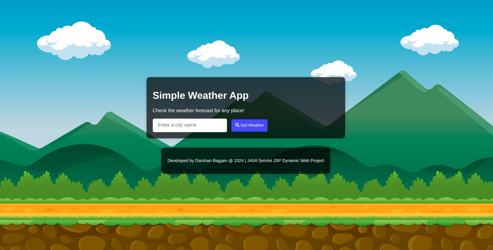
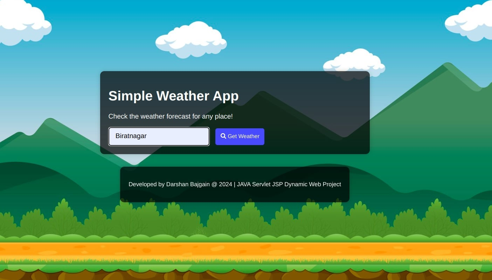
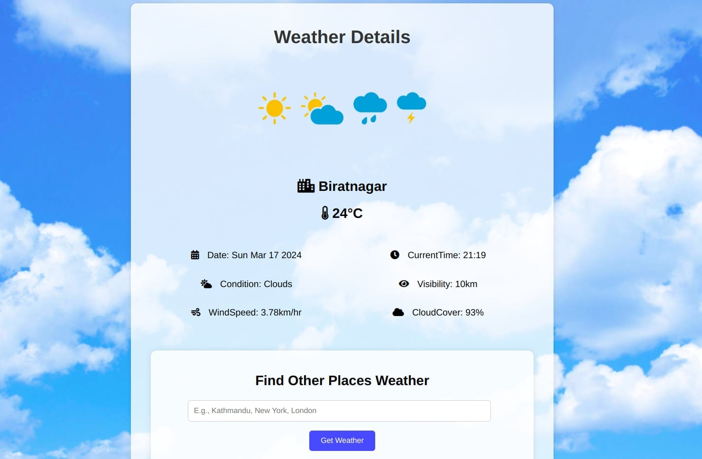

# WeatherApp USING JAVA SERVLET JSP

## Description
WeatherApp is a simple Java web application developed using Servlets, JSP, HTML, CSS, and JavaScript. It integrates with the OpenWeatherMap API to fetch weather data for a given city and display it to the user.

## Features
Fetch weather data based on the user's input city name.
Display current weather conditions including temperature, humidity, wind speed, visibility, and cloud cover, etc.

## Technologies Used
- Java Servlets
- JavaServer Pages (JSP)
- HTML
- CSS
- JavaScript
- Gson library for JSON parsing
- OpenWeatherMap API

## Setup Instructions
1. Download and install Eclipse IDE (or IntelliJ IDEA).
2. Download and install Apache Tomcat 10.1.1.
3. Open Eclipse IDE and configure it with Apache Tomcat:
   - Go to `Window` -> `Preferences`.
   - Navigate to `Server` -> `Runtime Environments`.
   - Click `Add` and select `Apache Tomcat v10.1.1`.
   - Provide the Tomcat installation directory and finish the setup.
4. Clone the repository to your local machine using `git clone <repository_url>`.
5. Import the project into Eclipse IDE:
   - Go to `File` -> `Import`.
   - Select `Existing Projects into Workspace`.
   - Choose the cloned project directory and import it into Eclipse.
6. Ensure that the Gson library is included in the `src/webapp/WEB-INF/lib` directory of your project. If not, add it manually to the build path.
7. Obtain an API key from OpenWeatherMap and replace the placeholder `myApiKey` in `MyServlet.java` with your actual API key.
8. Run the application on your local Apache Tomcat server:
   - Right-click on the project in Eclipse.
   - Go to `Run As` -> `Run on Server`.
   - Select your configured Tomcat server and click `Finish`.
9. Access the WeatherApp through your web browser using the provided URL (usually `http://localhost:8080/WeatherApp`).

## API Integration in Servlet:
- Created a Java servlet (MyServlet.java) to handle HTTP requests.
- In the doPost method, fetched the city name from the form input.
- Constructed the API URL with the city name and your API key (apiUrl) to fetch weather data.

 ### HTTP Request to API:
   -  Used HttpURLConnection to establish a connection to the API endpoint.
   - Set the request method to GET and retrieved the API response using input streams.

 ### Processing API Response:
  - The API response was in JSON format.
  - Used the Gson library to parse the JSON response into a JsonObject.
  - Extracted relevant weather data like temperature, humidity, wind speed, visibility, weather condition, and cloud cover from the JSON response.
    
### Setting Request Attributes:

  - Stored the extracted weather data, city name, date, time, and other relevant information as request attributes using HttpServletRequest.setAttribute().

### Forwarding Request to JSP:

  - Forwarded the request to the JSP page (index.jsp) for rendering using RequestDispatcher.forward().

## Displaying Data in JSP:

  - In our JSP page (index.jsp), we used HTML and embedded Java code (EL expressions) to display the weather data.
  - Accessed the data from request attributes using ${attributeName} syntax.

## Screenshots

## Created by:
- [Darshan Bajgain](https://github.com/darshanbajgain) 

